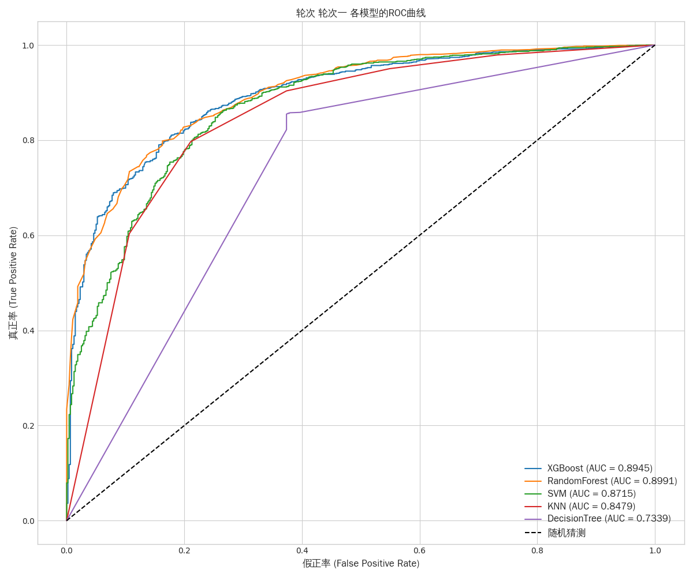
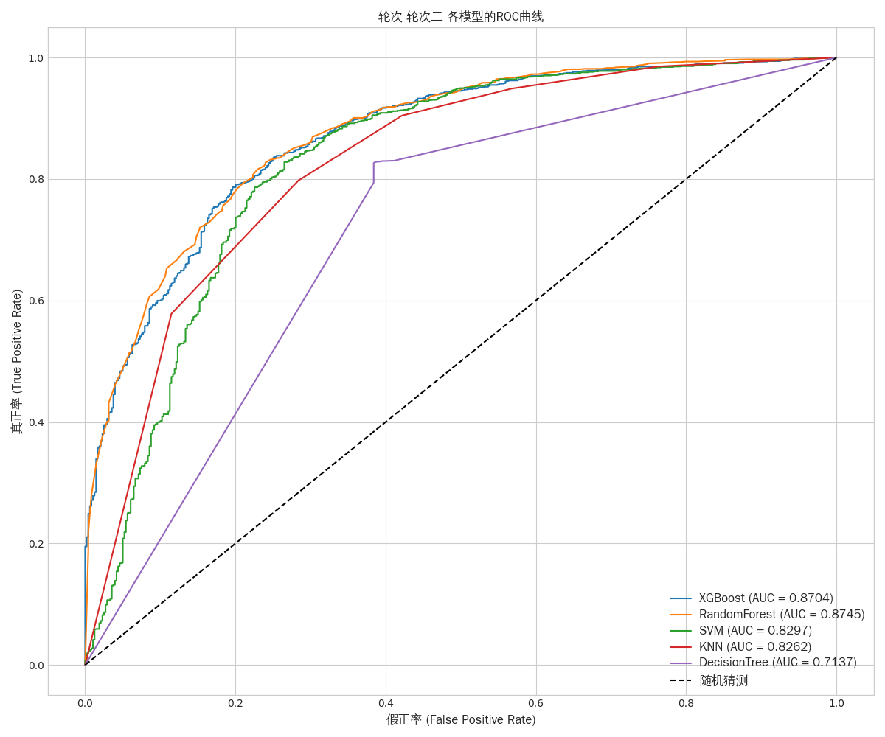

# 🚀 Steam 游戏评论情感分析

本项目是一个完整的机器学习流程，旨在对 Steam 游戏评论进行情感倾向（好评/差评）的分析与预测。项目涵盖了从数据爬取、文本预处理、特征工程到模型训练与评估的全过程。

## 🛠️ 核心功能

- **数据采集**: 内置爬虫 (`src/scraping/steam_crawler.py`)，可以从 Steam 平台根据 App ID 爬取游戏评论。
- **文本预处理**: 对评论文本进行清洗、分词、去除停用词等操作 (`src/preprocessing/text_processor.py`)。
- **特征工程**: 将处理后的文本转换为机器学习模型可以识别的数字特征（如 TF-IDF） (`src/features/feature_builder.py`)。
- **模型训练与评估**: 支持多种分类模型（如逻辑回归、支持向量机、朴素贝叶斯、XGBoost等）的训练、评估和比较 (`src/models/experiment_runner.py`)。
- **自动化流程**: 通过 `main.py` 一键执行从数据处理到模型评估的完整流程，并自动保存结果。

## 🏗️ 项目结构

```bash
.
├── data
│   └── labeled_comments.csv      # 用于训练和评估的已标注数据集
├── results
│   ├── run.log                   # 运行日志
│   ├── 轮次一/                   # 各轮实验结果
│   ├── ...
│   └── 所有轮次比较.xlsx        # 所有实验结果汇总
├── src
│   ├── features
│   │   └── feature_builder.py    # 特征工程模块
│   ├── models
│   │   └── experiment_runner.py  # 模型实验与评估模块
│   ├── preprocessing
│   │   └── text_processor.py     # 文本预处理模块
│   ├── scraping
│   │   └── steam_crawler.py      # 数据爬取模块
│   └── utils
│       └── helpers.py            # 辅助函数
├── main.py                       # 项目主入口
├── requirements.txt              # Python 依赖库
└── README.md                     # 项目说明
```

## ⚙️ 环境配置与安装

### 1. 克隆项目

```bash
git clone <your-repository-url>
cd steam-reviews-analysis
```

### 2. 创建虚拟环境 (推荐)

```bash
python -m venv venv
source venv/bin/activate  # On Windows use `venv\Scripts\activate`
```

### 3. 安装依赖

项目所需的依赖库已在 `requirements.txt` 中列出。通过以下命令安装：

```bash
pip install -r requirements.txt
```

## 🏁 使用方法

直接运行 `main.py` 即可启动完整的分析流程。程序将自动加载数据、进行预处理、构建特征、训练和评估多种模型，并将每轮的结果保存在 `results` 目录下。

```bash
python main.py
```

### 📊 实验结果总结

项目通过多轮实验，比较了不同模型在 Steam 评论情感分类任务上的表现。根据 `results/所有轮次比较.xlsx` 文件中的数据，核心模型的平均性能指标（如准确率、F1分数）总结如下：

| 模型 (Model)              | 平均准确率 (Accuracy) | 平均精确率 (Precision) | 平均召回率 (Recall) | 平均 F1 分数 (F1 Score) |
| ----------------------- | ---------------- | ----------------- | -------------- | ------------------- |
| XGBoost                 | 0.844            | 0.845             | 0.844          | 0.843               |
| Logistic Regression     | 0.841            | 0.848             | 0.841          | 0.841               |
| SVM                     | 0.840            | 0.842             | 0.840          | 0.840               |
| Multinomial Naive Bayes | 0.819            | 0.820             | 0.819          | 0.819               |
| Random Forest           | 0.803            | 0.806             | 0.803          | 0.802               |
| Decision Tree           | 0.741            | 0.742             | 0.741          | 0.741               |

**📑 导出到 Google 表格**
（注：以上数据来源于对所有实验轮次结果的平均值计算，具体每轮次的详细分数请参见 `results` 目录下的 `model_comparison.csv` 文件。）

### 🎯 结论:

从多次实验的平均结果来看，XGBoost 在综合性能（准确率和F1分数）上表现最佳，是此任务场景下的首选模型。逻辑回归在精确率上略有优势，适用于需要强调精准分类的场景。

**下面是主要的几个ROC曲线图**



其他图片请前往results文件夹查看

➡️ **[点击此处查看项目其他轮次结果](./results/)**

---

### 如何使用
...

### ✨ 未来可优化方向:

* **模型优化与调参**: 可进一步调优 XGBoost 和 Logistic Regression 的超参数，以提升模型性能。
* **数据增强**: 增加更多的训练数据或使用数据增强技术来提高模型的泛化能力。

 😊

